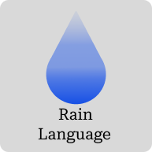

# Rain programming language

## Why did i want to create "Rain"?

I want to create a **game programming language** for there is just not one specifically for game development in mind out there today.

My goal is to create a fast and better language for building games and apps in general (but mostly games 😃).

**Files in [`src/`](src/) folder are not intended to be used for now**, it was used before for testing lexing of the language.

Here is the syntax I'm thinking to implement, of course that would happen far in the future: [language_syntax.rain file](language_syntax.rain).
